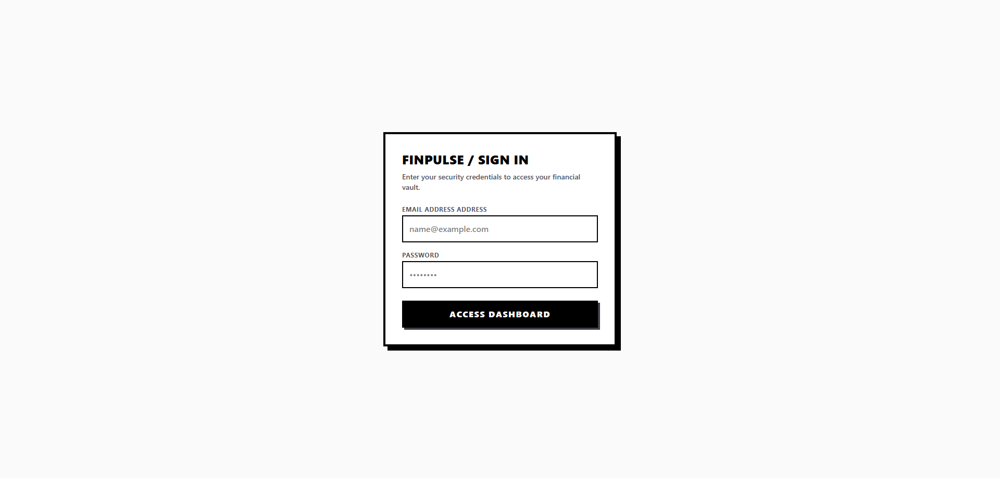
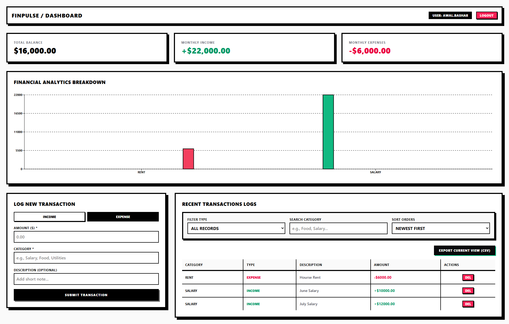

# 🚀 FinPulse Tracker

A modern, secure, and scalable **Full-Stack Personal Finance Management Application** built with **Next.js, Express.js, PostgreSQL, and Prisma**.

FinPulse Tracker helps users manage their daily income and expenses with a clean user interface, secure authentication, and high-performance backend architecture.

---

## 📸 Project Preview

> Add screenshots or GIFs here.

| Dashboard | Transactions |
|-----------|--------------|
|  |  |

---

# 🌐 Live Demo

### Frontend
👉 https://finpulse-tracker.vercel.app/

---

# ✨ Features

### 🔐 Authentication
- JWT Authentication
- Secure User Registration
- Secure Login
- Password Hashing with bcryptjs
- Protected Routes

### 💰 Transaction Management
- Add Income
- Add Expenses
- View Transaction History
- Delete Transactions
- User-specific Data Isolation

### 📊 Performance
- Optimized Database Queries
- Fast API Responses
- Clean REST Architecture
- Responsive UI

### 🛡️ Security
- JWT Middleware
- Password Encryption
- Environment Variables
- Protected API Endpoints

### 📱 User Experience
- Responsive Design
- Clean Dashboard
- Modern UI
- Fast Navigation

---

# 🛠 Tech Stack

## Frontend

- Next.js
- React.js
- Tailwind CSS
- Axios

## Backend

- Node.js
- Express.js

## Database

- PostgreSQL
- Neon Database

## ORM

- Prisma ORM

## Authentication

- JWT (jsonwebtoken)
- bcryptjs

## Deployment

- Vercel

---

# 📁 Project Structure

```
FinPulse-Tracker/
│
├── frontend/
│   ├── app/
│   ├── components/
│   ├── public/
│   ├── styles/
│   └── ...
│
├── backend/
│   ├── prisma/
│   ├── controllers/
│   ├── middleware/
│   ├── routes/
│   ├── models/
│   ├── config/
│   └── server.js
│
└── README.md
```

---

# ⚙️ Installation

## 1. Clone Repository

```bash
git clone https://github.com/your-username/finpulse-tracker.git

cd finpulse-tracker
```

---

## 2. Backend Setup

```bash
cd backend

npm install
```

---

## 3. Configure Environment Variables

Create a `.env` file inside the backend directory.

```env
DATABASE_URL=your_postgresql_connection_string

JWT_SECRET=your_super_secret_key

PORT=5000
```

---

## 4. Prisma Setup

Generate Prisma Client

```bash
npx prisma generate
```

Push Schema

```bash
npx prisma db push
```

(Optional)

```bash
npx prisma studio
```

---

## 5. Start Backend

```bash
npm run dev
```

---

## 6. Frontend Setup

```bash
cd ../frontend

npm install

npm run dev
```

---

# 🔌 REST API

## Authentication

| Method | Endpoint | Access |
|----------|-----------------|-----------|
| POST | `/api/users/register` | Public |
| POST | `/api/auth/login` | Public |

---

## Transactions

| Method | Endpoint | Access |
|----------|----------------------|------------|
| GET | `/api/transactions` | Protected |
| POST | `/api/transactions` | Protected |
| DELETE | `/api/transactions/:id` | Protected |

---

# 📦 Dependencies

| Package | Version |
|----------|----------|
| express | ^5.2.1 |
| prisma | ^7.8.0 |
| @prisma/client | Latest |
| jsonwebtoken | ^9.0.3 |
| bcryptjs | ^3.0.3 |
| pg | ^8.22.0 |
| dotenv | ^17.4.2 |

---

# 🔒 Security

✔ JWT Authentication

✔ Password Hashing (bcryptjs)

✔ Environment Variables

✔ Protected Routes

✔ User Data Isolation

✔ Secure Database Access

---

# ⚡ Performance Optimizations

- Efficient Prisma Queries
- Lightweight REST API
- Optimized React Rendering
- Fast PostgreSQL Database
- Core Web Vitals Friendly

---

# 🚀 Future Improvements

- 📈 Expense Analytics Dashboard
- 📊 Charts & Reports
- 🌙 Dark Mode
- 📅 Monthly Budget Planning
- 💳 Multiple Wallet Support
- 🔔 Email Notifications
- 📤 Export PDF / Excel Reports
- 🤖 AI-based Expense Prediction
- 📱 Progressive Web App (PWA)

---

# 🤝 Contributing

Contributions are always welcome.

1. Fork the repository

2. Create your feature branch

```bash
git checkout -b feature/AmazingFeature
```

3. Commit your changes

```bash
git commit -m "Add Amazing Feature"
```

4. Push to your branch

```bash
git push origin feature/AmazingFeature
```

5. Open a Pull Request

---

# ⭐ Support

If you found this project helpful, please consider giving it a ⭐ on GitHub.

It helps others discover the project and motivates further development.

---

# 👨‍💻 Author

## MD Awal Bashar

**Full Stack Web & Machine Learning Engineer**

- 🌐 Portfolio: https://bashar0091.github.io/awalbasharofficial/
- 💼 LinkedIn: https://www.linkedin.com/in/awalbashar/
- 📧 Email: awalbashar194@gmail.com
- 🐙 GitHub: https://github.com/bashar0091

---

# 📄 License

This project is licensed under the **MIT License**.

Feel free to use, modify, and distribute this project.

---

## ❤️ Built with Next.js, Express.js, Prisma & PostgreSQL